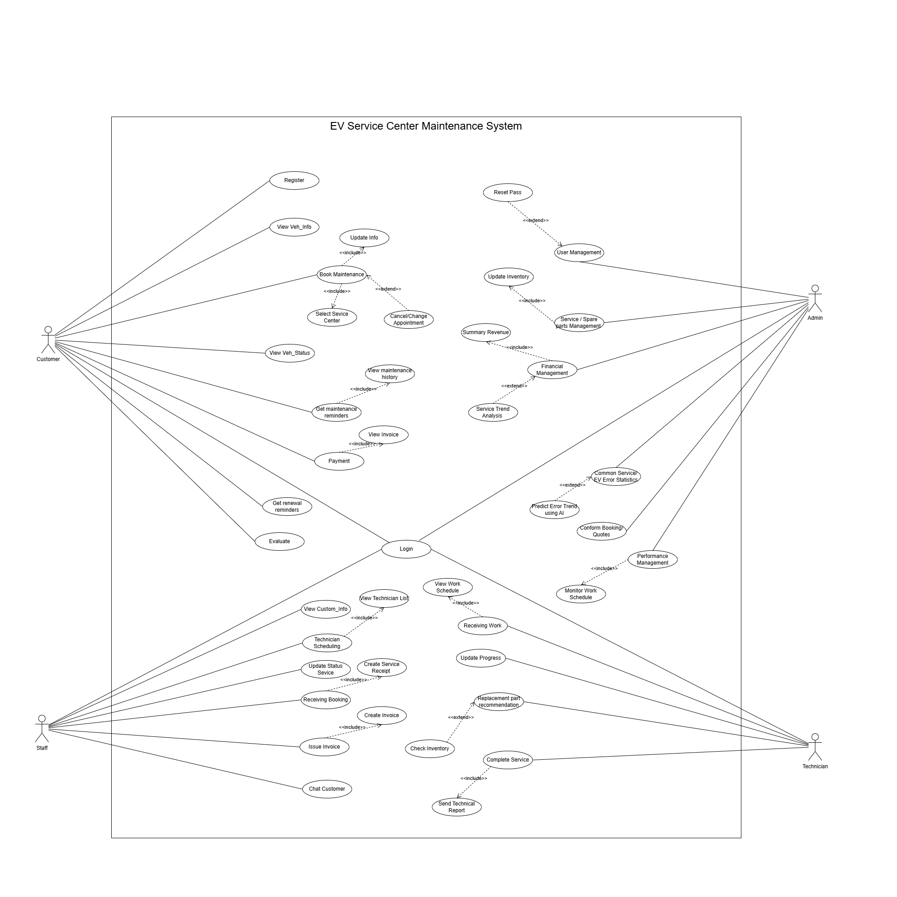

# Tài liệu đặc tả yêu cầu
**Project:** EV Service Center Maintenance Management System
## 1. Giới thiệu
### 1.1. Mục đích
Tài liệu này mô tả chi tiết các yêu cầu chức năng và phi chức năng của hệ thống EV Service Center Maintenance Management System (EVSCMMS) – một phần mềm được thiết kế nhằm hỗ trợ các trung tâm dịch vụ quản lý toàn bộ quy trình bảo dưỡng, sửa chữa và quản lý khách hàng đối với xe điện (Electric Vehicle – EV).  
Mục tiêu của hệ thống là:
- Cung cấp một nền tảng số hóa quy trình bảo dưỡng xe điện, giúp khách hàng dễ dàng đặt lịch và theo dõi tình trạng xe.
- Hỗ trợ trung tâm dịch vụ (staff, kỹ thuật viên, quản trị viên) trong việc tiếp nhận, quản lý lịch hẹn, quy trình bảo dưỡng, phụ tùng, nhân sự và tài chính.
- Tối ưu hiệu suất vận hành của trung tâm và nâng cao trải nghiệm khách hàng thông qua các tính năng tự động hóa, gợi ý thông minh và báo cáo thống kê.
### 1.2. Phạm vi
Phần mềm EV Service Center Maintenance Management System là hệ thống web/app tích hợp dành cho các trung tâm dịch vụ xe điện và khách hàng.  
Hệ thống cho phép:
- **Khách hàng (Customer):** đặt lịch bảo dưỡng, nhận thông báo nhắc nhở định kỳ, thanh toán trực tuyến, theo dõi trạng thái xe và lưu lịch sử dịch vụ.
- **Nhân viên trung tâm (Staff):** quản lý hồ sơ khách hàng, lập lịch, tiếp nhận xe và theo dõi tiến độ bảo dưỡng.
- **Kỹ thuật viên (Technician):** cập nhật tình trạng xe, ghi nhận thông tin kiểm tra, thay thế phụ tùng và hoàn tất phiếu dịch vụ.
- **Quản trị viên (Admin):** giám sát toàn bộ hoạt động, quản lý nhân sự, phụ tùng, tài chính và khai thác báo cáo thống kê.  

Phạm vi triển khai của hệ thống bao gồm:
- Trung tâm bảo dưỡng xe điện quy mô nhỏ đến lớn.
- Môi trường web (trình duyệt).
- Tích hợp thanh toán online qua ví điện tử hoặc ngân hàng.
### 1.3. Đối tượng sử dụng
**Customer**: Đặt lịch, theo dõi tình trạng xe, nhận nhắc nhở, thanh toán online.  
**Staff**: Tiếp nhận yêu cầu dịch vụ, lập lịch, quản lý hồ sơ khách hàng & xe.  
**Technician**: Thực hiện quy trình bảo dưỡng, cập nhật tiến độ, ghi nhận tình trạng xe và phụ tùng.  
**Admin**: Quản lý hệ thống, nhân sự, tài chính, phụ tùng, báo cáo thống kê, phân quyền người dùng.  

## 2. Mô tả tổng quan
### 2.1 Bối cảnh hệ thống
Hệ thống **EVSCMMS** là một ứng dụng quản lý tổng thể dành cho **trung tâm dịch vụ bảo dưỡng xe điện**. Hệ thống được thiết kế theo **mô hình client–server**, hoạt động trên nền **web**, giúp kết nối **khách hàng, nhân viên, kỹ thuật viên,** và **quản trị viên** trong cùng một nền tảng duy nhất.  
**Mô hình tổng quan hệ thống**
- **Người dùng bên ngoài**: Khách hàng (Customer).
- **Người dùng nội bộ**: Nhân viên trung tâm (Staff), Kỹ thuật viên (Technician), Quản trị viên (Admin).
- **Thành phần hệ thống chính**:  
    + **Giao diện người dùng (UI Layer)**: Web/App dành cho từng nhóm người dùng.
    + **Lớp dịch vụ ứng dụng (Application Layer)**: Xử lý logic nghiệp vụ (đặt lịch, theo dõi tiến độ, thanh toán...).
    + **Cơ sở dữ liệu trung tâm (Database Layer)**: Lưu trữ thông tin khách hàng, xe, lịch sử bảo dưỡng, phụ tùng, nhân sự và báo cáo.
    + **Tích hợp ngoài (External Services)**: Thanh toán trực tuyến, gửi thông báo qua app.  

**Tóm tắt luồng hoạt động tổng quát**
1. Khách hàng đăng nhập vào hệ thống → đặt lịch bảo dưỡng/sửa chữa.
2. Nhân viên tiếp nhận yêu cầu → lập lịch cho kỹ thuật viên phù hợp.
3. Kỹ thuật viên thực hiện bảo dưỡng → cập nhật tiến độ và tình trạng xe.
4. Hệ thống tạo hóa đơn → khách hàng thanh toán trực tuyến.
5. Quản trị viên theo dõi báo cáo doanh thu, quản lý nhân sự và phụ tùng.

### 2.2. Các tác nhân hệ thống
**Actor:** Customer  
**Vai trò:** Người sử dụng dịch vụ  
**Mô tả chi tiết:** Đặt lịch bảo dưỡng, nhận nhắc nhở, theo dõi tiến độ và thanh toán online.

**Actor:** Staff  
**Vai trò:** Người tiếp nhận yêu cầu  
**Mô tả chi tiết:** Quản lý lịch hẹn, hồ sơ khách hàng, tiếp nhận xe, tạo phiếu dịch vụ.

**Actor:** Technician  
**Vai trò:** Người trực tiếp thực hiện bảo dưỡng  
**Mô tả chi tiết:** Cập nhật tiến trình, tình trạng xe, phụ tùng sử dụng, hoàn tất checklist bảo dưỡng.

**Actor:** Admin  
**Vai trò:** Người quản lý toàn hệ thống  
**Mô tả chi tiết:** Quản lý tài khoản người dùng, nhân sự, phụ tùng, báo cáo tài chính, thống kê.

**Actor:** Payment Gateway  
**Vai trò:** Dịch vụ bên ngoài  
**Mô tả chi tiết:** ĐXử lý các giao dịch thanh toán trực tuyến.

### 2.3. Các ràng buộc hệ thống (System Constraints)
- **Hạn chế kỹ thuật:**
    + Ứng dụng web chạy trên các trình duyệt phổ biến (Chrome, Edge, Safari).
    + Dữ liệu được lưu trữ trong hệ quản trị cơ sở dữ liệu MySQL hoặc PostgreSQL.
- **Hạn chế bảo mật:**
    + Mọi giao tiếp giữa client và server phải sử dụng HTTPS.
    + Thông tin người dùng, xe, và giao dịch phải được mã hóa.
    + Phân quyền truy cập nghiêm ngặt giữa các vai trò.
- **Hạn chế vận hành:**
    + Hệ thống cần hoạt động 24/7, thời gian downtime không vượt quá 1%/tháng.
    + Mỗi trung tâm có thể quản lý tối đa 1.000 xe đang hoạt động đồng thời.
- **Hạn chế tích hợp:**
    + Chỉ hỗ trợ thanh toán qua các cổng phổ biến (MoMo, ZaloPay, VNPay, ngân hàng nội địa).

### 2.4. Giả định và phụ thuộc (Assumptions and Dependencies)
**Giả định:** Trung tâm dịch vụ có cơ sở hạ tầng mạng ổn định  
**Mô tả:** Hệ thống yêu cầu kết nối internet liên tục để đồng bộ dữ liệu.

**Giả định:** Người dùng có tài khoản hợp lệ  
**Mô tả:** Tất cả người dùng (Customer, Staff, Technician, Admin) phải đăng ký/được cấp tài khoản trước khi sử dụng.

**Giả định:** Hệ thống thanh toán bên thứ ba hoạt động ổn định  
**Mô tả:** Việc thanh toán online phụ thuộc vào API của đối tác (MoMo, VNPay...).

**Giả định:** Dữ liệu đầu vào (km, thời gian bảo dưỡng, thông tin xe) được nhập chính xác   
**Mô tả:** Các tính năng nhắc nhở và báo cáo phụ thuộc vào độ chính xác dữ liệu.

**Giả định:** Các trung tâm có quy trình bảo dưỡng EV chuẩn hóa    
**Mô tả:** Đảm bảo quy trình và checklist được áp dụng đồng nhất trên toàn hệ thống.

### 2.5. Mô hình kiến trúc dự kiến (Proposed System Architecture)
**Frontend:**  
- Web: ReactJS.  

**Backend:**
- Framework: .NET Core / Node.js / Java Spring Boot.  
- Database: MySQL.  
- RESTful API để kết nối các thành phần.

**Hệ thống hỗ trợ:**
- Module phân tích và gợi ý tồn kho tối thiểu phụ tùng dựa trên AI logic nội bộ
- Module nhắc nhở khách hàng nghiệp vụ bảo dưỡng, hóa đơn, dịch vụ qua hệ thống API.
- Tích hợp thanh toán online mô phỏng qua getway phổ biến (MoMo, VNPay, ZaloPay).

## 3. Yêu cầu chức năng (Functional Requirements)
### 3.1. Chức năng cho Khách hàng (Customer)
#### 3.1.1. Theo dõi xe & Nhắc nhở bảo dưỡng
**Mục tiêu:** Giúp khách hàng quản lý tình trạng xe điện và nhận nhắc nhở định kỳ.  
**Mô tả:**
- Hệ thống tự động gửi thông báo bảo dưỡng khi xe đạt số km hoặc thời gian quy định.
- Gửi nhắc nhở thanh toán hoặc gia hạn gói bảo dưỡng.  

**Dữ liệu vào:** Thông tin xe (VIN, model, số km hiện tại), ngày bảo dưỡng gần nhất.  
**Dữ liệu ra:** Thông báo nhắc bảo dưỡng (qua app/email/SMS).  
**Điều kiện trước:** Khách hàng đã đăng ký xe trong hệ thống.  
**Điều kiện sau:** Khách hàng nhận được thông báo; trạng thái nhắc nhở được lưu trong lịch sử.  
**Mức độ ưu tiên:** Cao.

#### 3.1.2. Đặt lịch dịch vụ
**Mục tiêu:** Cho phép khách hàng đặt lịch bảo dưỡng hoặc sửa chữa trực tuyến.  
**Mô tả:**
- Khách hàng chọn trung tâm dịch vụ, loại dịch vụ, và thời gian mong muốn.
- Nhận xác nhận đặt lịch và thông báo trạng thái.

**Dữ liệu vào:** Thông tin khách hàng, loại dịch vụ, thời gian mong muốn.  
**Dữ liệu ra:** Phiếu xác nhận lịch hẹn, mã lịch hẹn (Booking ID).  
**Điều kiện trước:** Người dùng đăng nhập hợp lệ.  
**Điều kiện sau:** Lịch hẹn được lưu và chờ xác nhận từ nhân viên.  
**Mức độ ưu tiên:** Cao.

#### 3.1.3. Quản lý hồ sơ & chi phí
**Mục tiêu:** Cho phép khách hàng theo dõi lịch sử dịch vụ, chi phí và hóa đơn.  
**Mô tả:**
- Hiển thị danh sách các lần bảo dưỡng/sửa chữa.
- Cho phép xem chi tiết từng hóa đơn, thanh toán online.

**Dữ liệu vào:** Tài khoản khách hàng.  
**Dữ liệu ra:** Danh sách lịch sử bảo dưỡng, hóa đơn, tổng chi phí.  
**Điều kiện trước:** Đã có ít nhất một lần sử dụng dịch vụ.  
**Điều kiện sau:** Khách hàng có thể xem và in hóa đơn điện tử.  
**Mức độ ưu tiên:** Trung bình – Cao.

### 3.2. Chức năng cho Nhân viên Trung tâm (Staff)
#### 3.2.1. Quản lý khách hàng & xe
**Mục tiêu:** Hỗ trợ nhân viên quản lý thông tin khách hàng và xe.  
**Mô tả:** 
- Thêm, sửa, xóa thông tin khách hàng và xe điện (model, VIN, lịch sử dịch vụ).
- Chat trực tuyến với khách hàng để xác nhận hoặc tư vấn dịch vụ.

**Dữ liệu vào:** Thông tin khách hàng và xe.  
**Dữ liệu ra:** Hồ sơ khách hàng được lưu trong hệ thống.  
**Điều kiện trước:** Nhân viên có quyền truy cập hợp lệ.  
**Điều kiện sau:** Dữ liệu được cập nhật đồng bộ với hệ thống CRM.  
**Mức độ ưu tiên:** Cao.

#### 3.2.2. Quản lý lịch hẹn & dịch vụ
**Mục tiêu:** Giúp nhân viên tiếp nhận và sắp xếp các yêu cầu dịch vụ.  
**Mô tả:**
- Nhân viên duyệt yêu cầu đặt lịch của khách hàng.
- Phân công kỹ thuật viên và lập kế hoạch làm việc.

**Dữ liệu vào:** Yêu cầu đặt lịch từ khách hàng.  
**Dữ liệu ra:** Lịch hẹn đã xác nhận, thông báo đến khách hàng.  
**Điều kiện trước:** Có yêu cầu đặt lịch từ khách hàng.  
**Điều kiện sau:** Lịch hẹn được cập nhật và phân công thành công.  
**Mức độ ưu tiên:** Cao.

#### 3.2.3. Quản lý phiếu dịch vụ & checklist EV
**Mục tiêu:** Quản lý quy trình tiếp nhận và kiểm tra xe.  
**Mô tả:**
- Tạo phiếu tiếp nhận dịch vụ khi khách hàng đến trung tâm.
- Ghi nhận tình trạng xe, phụ tùng cần thay, hạng mục kiểm tra.

**Dữ liệu vào:** Mã lịch hẹn, thông tin xe, checklist EV.  
**Dữ liệu ra:** Phiếu dịch vụ và trạng thái xe.  
**Điều kiện trước:** Xe được tiếp nhận tại trung tâm.  
**Điều kiện sau:** Thông tin được lưu và chuyển cho kỹ thuật viên.  
**Mức độ ưu tiên:** Cao.

### 3.3. Chức năng cho Kỹ thuật viên (Technician)
#### 3.3.1. Quản lý quy trình bảo dưỡng
**Mục tiêu:** Giúp kỹ thuật viên theo dõi và cập nhật tiến độ công việc.  
**Mô tả:**
- Cập nhật trạng thái xe: “Chờ”, “Đang bảo dưỡng”, “Hoàn tất”.
- Ghi chú các hạng mục đã thực hiện và phụ tùng sử dụng.

**Dữ liệu vào:** Mã phiếu dịch vụ, thông tin kiểm tra.  
**Dữ liệu ra:** Cập nhật trạng thái xe và báo cáo tiến độ.  
**Điều kiện trước:** Có phiếu dịch vụ được giao.  
**Điều kiện sau:** Báo cáo hoàn tất được lưu trong lịch sử xe.  
**Mức độ ưu tiên:** Cao.

#### 3.3.2. Ghi nhận tình trạng xe và phụ tùng
**Mục tiêu:** Cập nhật chi tiết kết quả kiểm tra và đề xuất thay thế.  
**Mô tả:**
- Ghi nhận tình trạng các bộ phận của xe điện.
- Đề xuất phụ tùng cần thay thế và gửi cho nhân viên duyệt.

**Dữ liệu vào:** Dữ liệu kiểm tra xe, ảnh, ghi chú kỹ thuật viên.  
**Dữ liệu ra:** Báo cáo kỹ thuật, danh sách phụ tùng cần thay.  
**Điều kiện trước:** Xe đang ở trạng thái “Đang bảo dưỡng”.  
**Điều kiện sau:** Báo cáo kỹ thuật được xác nhận và lưu.  
**Mức độ ưu tiên:** Trung bình – Cao.

### 3.4. Chức năng cho Quản trị viên (Admin)
#### 3.4.1. Quản lý phụ tùng
**Mục tiêu:** Theo dõi và quản lý kho phụ tùng EV tại trung tâm.  
**Mô tả:**
- Theo dõi số lượng nhập – xuất – tồn kho.
- Đặt ngưỡng tồn kho tối thiểu.
= Hệ thống AI gợi ý lượng phụ tùng cần nhập thêm dựa trên lịch sử sử dụng.

**Dữ liệu vào:** Danh sách phụ tùng, lượng tồn, lịch sử thay thế.  
**Dữ liệu ra:** Báo cáo tồn kho, đề xuất nhập hàng.  
**Điều kiện trước:** Dữ liệu phụ tùng đã được khai báo.  
**Điều kiện sau:** Hệ thống cập nhật kho tự động.  
**Mức độ ưu tiên:** Cao.

#### 3.4.2. Quản lý nhân sự
**Mục tiêu:** Quản lý và phân công kỹ thuật viên theo ca/lịch.  
**Mô tả:**
- Tạo, sửa, xóa hồ sơ nhân viên.
- Theo dõi thời gian làm việc và hiệu suất.
- Quản lý chứng chỉ chuyên môn của kỹ thuật viên.

**Dữ liệu vào:** Hồ sơ nhân sự, lịch làm việc, dữ liệu chấm công.  
**Dữ liệu ra:** Báo cáo hiệu suất, phân công kỹ thuật viên.  
**Điều kiện trước:** Có danh sách nhân viên hợp lệ.  
**Điều kiện sau:** Dữ liệu được lưu và cập nhật lịch làm việc.  
**Mức độ ưu tiên:** Trung bình – Cao.

#### 3.4.3. Quản lý tài chính & báo cáo
**Mục tiêu:** Theo dõi doanh thu, chi phí và hiệu quả hoạt động của trung tâm.  
**Mô tả:**
- Quản lý quy trình báo giá → hóa đơn → thanh toán (online/offline).
- Tổng hợp báo cáo doanh thu, chi phí, lợi nhuận theo thời gian.
- Thống kê loại dịch vụ phổ biến và xu hướng hỏng hóc xe điện.

**Dữ liệu vào:** Dữ liệu giao dịch và dịch vụ hoàn tất.  
**Dữ liệu ra:** Báo cáo thống kê và biểu đồ phân tích.  
**Điều kiện trước:** Có dữ liệu dịch vụ và giao dịch.  
**Điều kiện sau:** Báo cáo được sinh tự động và xuất ra file (PDF, Excel).  
**Mức độ ưu tiên:** Cao.

## 4. Yêu cầu phi chức năng (Non-Functional Requirements)
### 4.1. Hiệu năng (Performance Requirements)
- Hệ thống phải xử lý tối thiểu 100 yêu cầu đồng thời từ người dùng mà không bị gián đoạn hoặc giảm hiệu suất đáng kể.
- Thời gian phản hồi trung bình của hệ thống cho các thao tác cơ bản (tra cứu, thêm, sửa, xóa dữ liệu) không vượt quá 3 giây.
- Hệ thống phải có khả năng mở rộng để đáp ứng nhu cầu của nhiều chi nhánh trung tâm dịch vụ trong tương lai.
- Tốc độ truy cập dữ liệu bảo trì, hồ sơ khách hàng và phụ tùng phải đảm bảo ổn định ngay cả khi cơ sở dữ liệu đạt trên 100.000 bản ghi.
### 4.2. Tính bảo mật (Security Requirements)
- Hệ thống phải đảm bảo xác thực người dùng bằng tài khoản và mật khẩu mã hóa.
- Phân quyền rõ ràng cho từng loại tài khoản:
	+ **Quản trị viên (Admin)**: quản lý toàn bộ hệ thống.
 	+ **Kỹ thuật viên (Technician)**: truy cập và cập nhật thông tin bảo trì.
  	+ **Nhân viên trung tâm (Staff)**: tiếp nhận xe và tạo phiếu dịch vụ.
	+ **Khách hàng (Customer)**: xem lịch sử bảo trì và đặt lịch hẹn.
- Dữ liệu khách hàng, đặc biệt là thông tin liên hệ và biển số xe, phải được bảo vệ khỏi truy cập trái phép.
- Hệ thống phải hỗ trợ sao lưu và phục hồi dữ liệu định kỳ để tránh mất mát thông tin.
- Tất cả các hoạt động quan trọng (đăng nhập, cập nhật dữ liệu, xóa thông tin) phải được ghi nhật ký (log) để phục vụ truy vết khi cần.

### 4.3. Tính khả dụng và độ tin cậy (Availability and Reliability)
- Hệ thống phải đảm bảo thời gian hoạt động (uptime) tối thiểu 99% trong năm.
- Phải có cơ chế tự động phát hiện lỗi và thông báo đến quản trị viên khi có sự cố.
- Dữ liệu quan trọng (hồ sơ bảo trì, thông tin khách hàng) phải được sao lưu tự động hàng ngày.
- Hệ thống cần hỗ trợ khôi phục dữ liệu trong vòng 1 giờ kể từ khi xảy ra sự cố.

### 4.4. Tính khả chuyển (Portability Requirements)
- Ứng dụng phải có khả năng triển khai trên nhiều môi trường: Windows, Linux và nền tảng web.
- Giao diện người dùng phải tương thích với nhiều trình duyệt phổ biến (Chrome, Edge, Firefox).
- Hệ thống có thể tích hợp với ứng dụng di động trong giai đoạn mở rộng (Mobile App).

### 4.5. Tính dễ sử dụng (Usability Requirements)
- Giao diện người dùng (UI) cần trực quan, thân thiện, dễ thao tác cho cả người không chuyên về công nghệ.
- Các chức năng chính (đặt lịch, xem thông tin bảo trì, quản lý phụ tùng, báo cáo) phải được bố trí rõ ràng và dễ truy cập.
- Hệ thống cần hỗ trợ ngôn ngữ tiếng Việt và tiếng Anh để thuận tiện cho người dùng đa quốc tịch.

### 4.6. Tính bảo trì và mở rộng (Maintainability and Scalability)
- Mã nguồn phải được thiết kế mô-đun hóa (modular) để dễ bảo trì, nâng cấp và mở rộng.
- Cấu trúc hệ thống cần cho phép thêm mới chức năng mà không ảnh hưởng đến các phần hiện có.
- Tài liệu kỹ thuật (Technical Documentation) phải được cập nhật song song với quá trình phát triển.
- Hệ thống hỗ trợ cập nhật phần mềm tự động hoặc bán tự động, đảm bảo người dùng luôn sử dụng phiên bản mới nhất.

### 4.7. Tính tương thích (Compatibility Requirements)
- Hệ thống phải tương thích với các phần mềm quản lý hiện có như hệ thống kế toán hoặc quản lý kho (Inventory Management).
- Phải hỗ trợ tích hợp API để trao đổi dữ liệu với các ứng dụng bên ngoài (ví dụ: ứng dụng đặt lịch, hệ thống thanh toán trực tuyến).
- Cơ sở dữ liệu tương thích với các hệ quản trị phổ biến như MySQL, PostgreSQL hoặc SQL Server.

## 5. Mô hình & sơ đồ (Models & Diagrams)
### 5.1. Sơ đồ Use Case tổng thể

### 5.2. Use Case chi tiết (mô tả, dòng sự kiện, actors liên quan)
#### 5.2.1. Use Case cho Khách hàng (Customer)
**Use Case 1: Đặt lịch bảo dưỡng / sửa chữa** (BookMaintenance)  
**Mô tả:** 
Khách hàng có thể đặt lịch bảo dưỡng hoặc sửa chữa xe điện thông qua hệ thống trực tuyến.  
**Tác nhân chính:** Customer  
**Tiền điều kiện:** 
- Khách hàng đã đăng nhập vào hệ thống.
- Xe của khách hàng đã được đăng ký trong hồ sơ.

**Hậu điều kiện:**
- Lịch hẹn được lưu thành công.
- Hệ thống gửi thông báo xác nhận đến khách hàng và trung tâm dịch vụ.

**Dòng sự kiện chính:**
1. Khách hàng chọn chức năng “Đặt lịch dịch vụ”.
2. Hệ thống hiển thị danh sách trung tâm dịch vụ và loại dịch vụ.
3. Khách hàng chọn trung tâm, loại dịch vụ, ngày và giờ mong muốn.
4. Hệ thống kiểm tra khả năng trống của lịch kỹ thuật viên.
5. Hệ thống xác nhận đặt lịch và lưu thông tin.
6. Hệ thống gửi thông báo xác nhận đến khách hàng.

**Luồng thay thế:**  
4a. Nếu không có lịch trống, hệ thống hiển thị thời gian khả dụng khác.

**Use Case 2: Theo dõi xe & nhận nhắc nhở bảo dưỡng** (View Veh_Status & Get Maintenance Reminders)  
**Mô tả:**
Khách hàng có thể xem tình trạng xe, lịch sử bảo dưỡng và nhận nhắc nhở bảo dưỡng định kỳ theo thời gian hoặc quãng đường.  
**Tác nhân chính:** Customer  
**Tiền điều kiện:** Xe đã được đăng ký trong hệ thống.  
**Hậu điều kiện:** Khách hàng nhận được thông báo nhắc nhở và có thể đặt lịch mới.  
**Dòng sự kiện chính:**
1. Khách hàng truy cập “Theo dõi xe của tôi”.
2. Hệ thống hiển thị thông tin xe, lịch sử dịch vụ và tình trạng hiện tại.
3. Hệ thống kiểm tra điều kiện bảo dưỡng (km, thời gian).
4. Nếu đến hạn, hệ thống gửi thông báo nhắc nhở.

**Use Case 3: Thanh toán online** (Payment)  
**Mô tả:**  
Khách hàng thanh toán cho dịch vụ bảo dưỡng thông qua ví điện tử hoặc ngân hàng trực tuyến.  
**Tác nhân chính:** Customer  
**Tiền điều kiện:**
- Dịch vụ đã hoàn tất.
- Hóa đơn đã được tạo.

**Hậu điều kiện:**
- Thanh toán được ghi nhận.
- Hệ thống gửi biên lai điện tử cho khách hàng.

**Dòng sự kiện chính:**
1. Khách hàng truy cập “Hóa đơn của tôi”.
2. Chọn phương thức thanh toán (e-wallet, banking, thẻ).
3. Hệ thống kết nối cổng thanh toán.
4. Khách hàng xác nhận và hoàn tất giao dịch.
5. Hệ thống cập nhật trạng thái thanh toán.

**Luồng thay thế:**  
4a. Nếu giao dịch thất bại, hệ thống thông báo lỗi và yêu cầu thử lại.

#### 5.2.2. Use Case cho Nhân viên trung tâm (Staff)
**Use Case 4: Tiếp nhận yêu cầu dịch vụ** (Receiving Booking)  
**Mô tả:**  
Nhân viên tiếp nhận yêu cầu bảo dưỡng từ khách hàng (trực tiếp hoặc qua hệ thống).  
**Tác nhân chính:** Staff
**Tiền điều kiện:** Hệ thống đang hoạt động, có quyền truy cập dữ liệu lịch hẹn.  
**Hậu điều kiện:** Phiếu tiếp nhận dịch vụ được tạo.  
**Dòng sự kiện chính:** 
1. Nhân viên truy cập danh sách yêu cầu dịch vụ.
2. Kiểm tra chi tiết xe và khách hàng.
3. Xác nhận yêu cầu và tạo phiếu tiếp nhận dịch vụ.
4. Phân công kỹ thuật viên xử lý.

**Use Case 5: Quản lý lịch hẹn & hàng chờ**  (Appoinment Management)
**Mô tả:**  
Nhân viên trung tâm có thể xem, chỉnh sửa, hoặc hủy các lịch hẹn.  
**Tác nhân chính:** Staff  
**Tiền điều kiện:** Có quyền truy cập module lịch hẹn.  
**Hậu điều kiện:** Lịch hẹn được cập nhật trong hệ thống.  
**Dòng sự kiện chính:**
1. Nhân viên mở giao diện “Lịch hẹn”.
2. Xem danh sách các cuộc hẹn theo ngày.
3. Thay đổi hoặc hủy nếu có yêu cầu từ khách hàng.
4. Hệ thống cập nhật lại trạng thái lịch hẹn.

#### 5.2.3. Use Case cho Kỹ thuật viên (Technician)
**Use Case 6: Cập nhật tình trạng bảo dưỡng** (Update Progress)  
**Mô tả:**  
Kỹ thuật viên ghi nhận tiến độ bảo dưỡng của xe.  
**Tác nhân chính:** Technician  
**Tiền điều kiện:** Phiếu tiếp nhận đã được giao cho kỹ thuật viên.  
**Hậu điều kiện:** Tiến độ bảo dưỡng được lưu và hiển thị cho khách hàng.  
**Dòng sự kiện chính:**
1. Kỹ thuật viên đăng nhập.
2. Xem danh sách xe được phân công.
3. Cập nhật trạng thái: “Đang làm”, “Hoàn tất”, “Cần phụ tùng”.
4. Hệ thống lưu lại thay đổi và thông báo cho khách hàng.

**Use Case 7: Ghi nhận tình trạng xe** (Record Veh_Status)  
**Mô tả:**  
Trước khi bảo dưỡng, kỹ thuật viên kiểm tra và ghi nhận tình trạng xe.  
**Tác nhân chính:** Technician  
**Tiền điều kiện:** Xe đã được tiếp nhận.  
**Hậu điều kiện:** Biên bản tình trạng xe được lưu trữ.  
**Dòng sự kiện chính:**
1. Kỹ thuật viên mở “Phiếu kiểm tra xe”.
2. Nhập các thông tin: tình trạng pin, động cơ, hệ thống phanh, đèn, v.v.
3. Hệ thống lưu lại kết quả.

#### 5.2.4. Use Case cho Quản trị viên (Admin)
**Use Case 8: Quản lý tài khoản người dùng** (User Management)  
**Mô tả:**  
Admin có thể tạo, chỉnh sửa hoặc khóa tài khoản nhân viên, kỹ thuật viên hoặc khách hàng.  
**Tác nhân chính:** Admin  
**Tiền điều kiện:** Admin đăng nhập hệ thống.  
**Hậu điều kiện:** Thông tin người dùng được cập nhật trong hệ thống.  
**Dòng sự kiện chính:**
1. Admin truy cập module “Quản lý người dùng”.
2. Tìm kiếm tài khoản cần thao tác.
3. Cập nhật thông tin hoặc trạng thái tài khoản.
4. Lưu thay đổi.

**Use Case 9: Quản lý phụ tùng & tồn kho** (Service / Spare parts Management)  
**Mô tả:**  
Admin theo dõi lượng phụ tùng EV tại trung tâm và thiết lập lượng tồn kho tối thiểu.  
**Tác nhân chính:** Admin  
**Tiền điều kiện:** Dữ liệu phụ tùng đã có trong hệ thống.  
**Hậu điều kiện:** Tồn kho được cập nhật, hệ thống gợi ý nhập hàng nếu sắp hết.  
**Dòng sự kiện chính:**
1. Admin mở “Kho phụ tùng”.
2. Xem danh sách và số lượng hiện tại.
3. Cập nhật hoặc thêm phụ tùng mới.
4. Hệ thống tính toán và đưa ra cảnh báo khi số lượng dưới ngưỡng tối thiểu.

**Use Case 10: Xem báo cáo tài chính & thống kê** (Financial Management)  
**Mô tả:**  
Admin có thể xem báo cáo doanh thu, chi phí, lợi nhuận, và thống kê dịch vụ.  
**Tác nhân chính:** Admin  
**Tiền điều kiện:** Dữ liệu giao dịch đã được ghi nhận.  
**Hậu điều kiện:** Báo cáo được hiển thị hoặc xuất file (PDF/Excel).  
**Dòng sự kiện chính:**
1. Admin chọn “Báo cáo tài chính”.
2. Chọn khoảng thời gian cần xem.
3. Hệ thống tổng hợp và hiển thị dữ liệu.
4. Admin có thể xuất file báo cáo.

### 5.3 Sơ đồ trình tự (Sequence Diagram)

**Mô tả tổng quan:**  
Sơ đồ trình tự thể hiện các tương tác động giữa các tác nhân (Customer, Staff, Technician, Admin) với hệ thống trong quá trình xử lý các nghiệp vụ chính.  
Hệ thống bao gồm các thành phần chính:
- **Customer:** người dùng cuối sử dụng xe điện.
- **System:** hệ thống phần mềm quản lý trung tâm bảo dưỡng xe điện.
- **Database:** nơi lưu trữ thông tin khách hàng, xe, lịch hẹn, phụ tùng, và giao dịch.
- **Staff:** nhân viên trung tâm tiếp nhận và xử lý yêu cầu của khách hàng.
- **Technician:** kỹ thuật viên thực hiện bảo dưỡng xe.
- **Payment:** hệ thống thanh toán trực tuyến.
- **Admin:** người quản trị giám sát hoạt động và báo cáo hệ thống.

**Các luồng chính trong sơ đồ:**  

**Luồng “Đặt lịch bảo dưỡng / sửa chữa”**  
1. Khách hàng đăng nhập vào hệ thống.
2. Hệ thống xác thực thông tin đăng nhập qua cơ sở dữ liệu.
3. Khách hàng chọn trung tâm dịch vụ, loại dịch vụ, thời gian mong muốn.
4. Hệ thống kiểm tra lịch trống và xác nhận đặt lịch.
5. Cơ sở dữ liệu lưu thông tin lịch hẹn.
6. Hệ thống gửi thông báo xác nhận cho khách hàng và nhân viên trung tâm.

**Luồng “Quy trình bảo dưỡng / sửa chữa”**
1. Nhân viên trung tâm tiếp nhận yêu cầu bảo dưỡng từ khách hàng.
2. Hệ thống gán yêu cầu cho kỹ thuật viên phù hợp.
3. Kỹ thuật viên kiểm tra tình trạng xe, ghi nhận kết quả ban đầu.
4. Trong quá trình bảo dưỡng, kỹ thuật viên cập nhật tiến độ (đang làm – hoàn tất).
5. Hệ thống cập nhật trạng thái xe cho khách hàng.
6. Nếu cần thay phụ tùng, hệ thống kiểm tra tồn kho và thông báo đến Admin khi lượng tồn xuống thấp.

**Luồng “Thanh toán dịch vụ”**
1. Sau khi xe hoàn tất bảo dưỡng, hệ thống tạo hóa đơn.
2. Khách hàng mở mục “Thanh toán hóa đơn”.
3. Hệ thống gửi yêu cầu đến cổng thanh toán (Payment).
4. Payment xác nhận giao dịch với ngân hàng.
5. Hệ thống nhận phản hồi và cập nhật trạng thái thanh toán.
6. Hóa đơn điện tử được gửi cho khách hàng.

**Luồng “Quản lí phụ tùng & Gợi ý tồn kho”**
1. Kỹ thuật viên yêu cầu sử dụng hoặc thay thế phụ tùng đến hệ thống.
2. Hệ thống kiểm tra hàng tồn kho qua cơ sở dữ liệu.
3. Hệ thống gửi yêu cầu cần duyệt đến Admin.
4. Admin phê duyệt yêu cầu và cập nhật hệ thống.
5. Hệ thống cập nhật tồn kho vào cơ sở dữ liệu.
6. Hệ thống phân tích dữ liệu phụ tùng và gửi báo cao đến Admin.

**Luồng "Báo cáo tài chính và thống kê dịch vụ"**
1. Admin yêu cầu xem báo cáo tài chính đến hệ thống.
2. Hệ thống truy xuất dữ liệu từ cơ sở dữ liệu.
3. Hệ thống xử lí, tổng hợp thống cơ dữ liệu từ cơ sở dữ liệu.
4. Hệ thống gửi báo cáo thống kê cho Admin.

	
	
	
	

